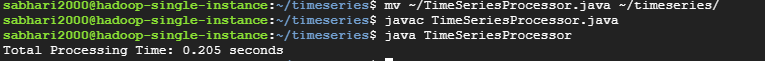

# Performance-Analysis-Single-Node-vs-Hadoop-MapReduce-for-Time-Series-Data-Processing
Implemented and compared two approaches for processing financial time series data (1.6M records). Hadoop MapReduce implementation using GCP Dataproc and  ingle-node Java implementation on GCP e2-standard-2 VM.

## Problem Statement

Analyzed performance characteristics of processing 1.6M financial time series records to find maximum close values per timestamp using three different architectures:

1. Hadoop cluster with 1 master + 4 workers
2. Hadoop cluster with 1 master + 2 workers
3. Single node implementation

   
## Dataset

The dataset used is historical stock price data for Meta (formerly Facebook), structured as follows:

timestamp,open,high,low,close,volume
30-09-2022 04:00,136.82,136.82,136.82,136.82,100
30-09-2022 04:01,137.77,137.79,137.77,137.77,400
30-09-2022 04:05,137.59,137.59,137.59,137.59,100

- **Size**: 162,280 rows x 6 columns
- **Frequency**: Minute-by-minute trading data

# System Architecture and Performance Analysis

## Table of Contents
- [System Architecture](#system-architecture)
- [Configuration Details](#configuration-details)
- [Implementation Approaches](#implementation-approaches)
- [Performance Analysis](#performance-analysis)
  - [Data Processing Statistics](#data-processing-statistics)
  - [Comparative Analysis](#comparative-analysis)
  - [Framework Overhead Analysis](#framework-overhead-analysis)
- [Key Findings](#key-findings)
- [Recommendations](#recommendations)
  - [When to Use Distributed Computing](#when-to-use-distributed-computing)
  - [When to Use Single Node](#when-to-use-single-node)
- [Conclusion](#conclusion)

---

## System Architecture

The system architecture comprises various approaches to processing data using distributed and single-node setups.

---

## Configuration Details

- **Machine Specifications:** Google Cloud `e2-standard-2` (2 vCPU, 8GB memory)

---

## Implementation Approaches

### 1. Hadoop Cluster (1 Master + 4 Workers)

- **Processing Time Breakdown:**
  - Map Phase: **10.578 seconds**
  - Reduce Phase: **10.448 seconds**
  - CPU Processing Time: **7.75 seconds**
- **Resource Utilization:**
  - Peak Map Memory: **623.67 MB**
  - Peak Reduce Memory: **404.09 MB**
  - GC Time: **236ms**

### 2. Hadoop Cluster (1 Master + 2 Workers)

- **Processing Time Breakdown:**
  - Map Phase: **10.704 seconds**
  - Reduce Phase: **9.731 seconds**
  - CPU Processing Time: **7.15 seconds**
- **Resource Utilization:**
  - Peak Map Memory: **809.80 MB**
  - Peak Reduce Memory: **426.99 MB**
  - GC Time: **190ms**

### 3. Single Node Implementation

- **Total Processing Time:** **0.205 seconds**
- **Characteristics:**
  - Direct memory access
  - No framework overhead
  - Sequential processing

---

## Performance Analysis

### Data Processing Statistics
- **Input Size:** 8,943,381 bytes
- **Records Processed:** 162,280
- **Output Size:** 30 bytes

### Comparative Analysis

| Metric            | 1M+4W Cluster | 1M+2W Cluster | Single Node |
|--------------------|---------------|---------------|-------------|
| **CPU Time**       | 7.75s         | 7.15s         | 0.205s      |
| **Map Time**       | 10.578s       | 10.704s       | N/A         |
| **Reduce Time**    | 10.448s       | 9.731s        | N/A         |
| **Memory Usage**   | 1027MB        | 1236MB        | <100MB      |

### Framework Overhead Analysis
#### Distributed Clusters
- Job initialization: ~16 seconds
- Resource allocation: ~2 seconds
- Data distribution: ~1 second
- Framework setup: ~3 seconds

#### Single Node
- No initialization overhead
- Direct file system access
- No network latency
- No data serialization/deserialization

---

## Key Findings

1. **Small Dataset Inefficiency**
   - Distributed processing introduces unnecessary overhead for small datasets (~9MB).
   - Network communication costs exceed parallel processing benefits.
   - Framework initialization dominates processing time.

2. **Resource Utilization**
   - Clusters showed higher memory usage due to framework requirements.
   - Single-node implementation is more memory-efficient for small datasets.
   - GC overhead is minimal in all cases.

3. **Scaling Effects**
   - Reducing workers from 4 to 2 had minimal impact on performance.
   - Dataset size was too small to leverage distributed processing effectively.

---

## Recommendations

### When to Use Distributed Computing
- **Dataset Size Threshold:** Recommended for datasets > 1GB.
- **Use Cases:**
  - Large-scale data processing
  - Complex aggregations across multiple dimensions
  - Fault-tolerant processing requirements

### When to Use Single Node
- **Dataset Characteristics:**
  - Small to medium datasets (<1GB)
  - Simple computations
  - Quick turnaround required
- **Resource Considerations:**
  - Limited infrastructure budget
  - Development/testing environments
  - Prototype implementations

---

## Conclusion

For this specific use case (1.6M records, simple max value computation), **single-node processing** is significantly more efficient. The overhead of distributed computing (job setup, network communication, resource allocation) outweighs its benefits for small datasets. 

**Consider distributed processing only when:**
- Dataset size exceeds several gigabytes.
- Complex computations are required.
- Fault tolerance is critical.
- Automatic scaling is needed.

This analysis highlights the importance of selecting the right tool based on data size, computation complexity, and processing requirements rather than assuming distributed computing is always better.

